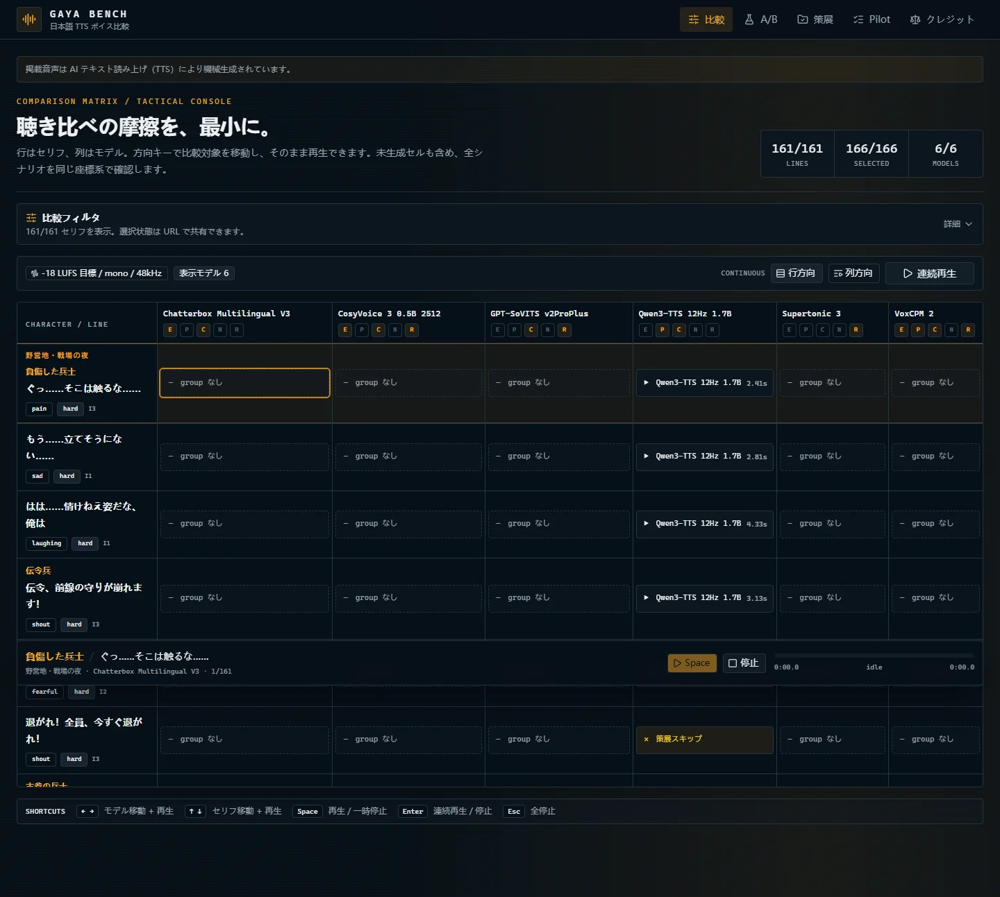
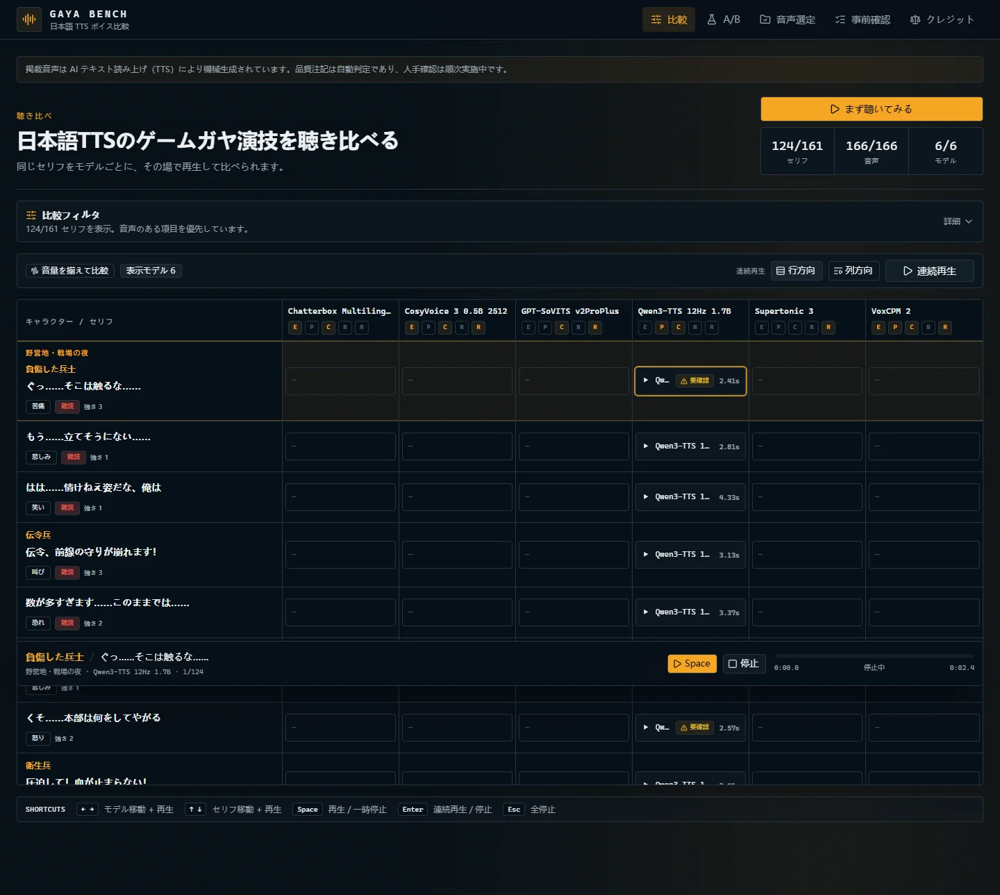
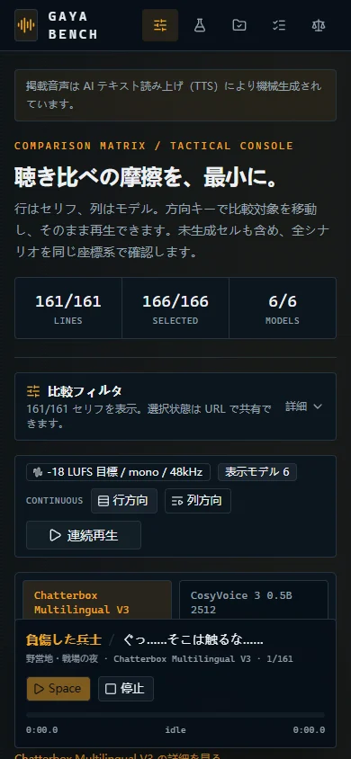
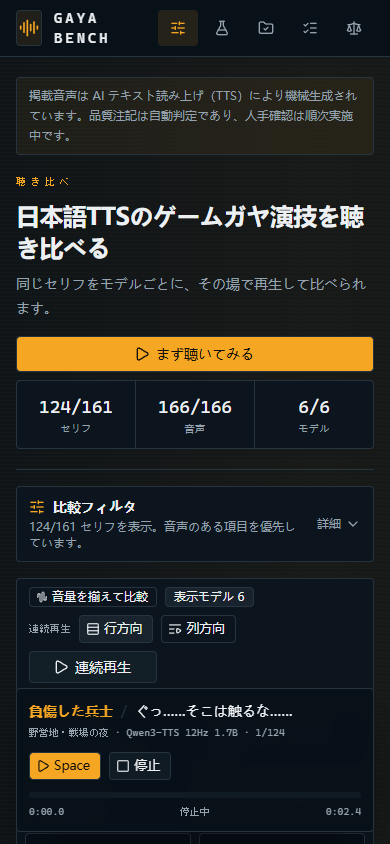

# Issue #154 P0 UX 改修

公開前に必要な P0 だけを、既存デザインシステムのまま先行修正した。全量 release 後の情報密度・レスポンシブ・描画性能の再調整は #154 P1 で行う。

## Desktop

| Before | After |
| --- | --- |
|  |  |

## Mobile

| Before | After |
| --- | --- |
|  |  |

## P0 で解消したこと

- ヒーローを1メッセージへ短縮し、「まず聴いてみる」で最初の再生可能セルを1クリック再生
- 既定表示を音声のある行・モデルに限定し、未収録セルを無地の `—` に静音化
- 感情・難易度・性別・年代の enum 生値を日本語ラベルへ変換し、既定の「標準」バッジを省略
- `TACTICAL CONSOLE`、`group なし`、`策展スキップ`、`selected outcome` などの内部語を公開 UI から除去
- `review_required` を「自動QC: 要確認」として表示し、自動判定・人手確認中の注記を全ページへ表示
- `/scenario`、`/models`、`/ab`、`/credits`、`/curate`、`/pilot` を同じ用語基準で一次監査

## 検証

- Desktop 1440×1000、mobile 390×844
- キーボード操作テストを含む全139テスト成功
- `vp check`、`vp build` 成功
- Chromium で全7画面を巡回し、対象内部語の露出なし、console error なし
- `prefers-reduced-motion` 利用者向けの既存 `motion-reduce` を維持し、新しい強制アニメーションは追加していない
