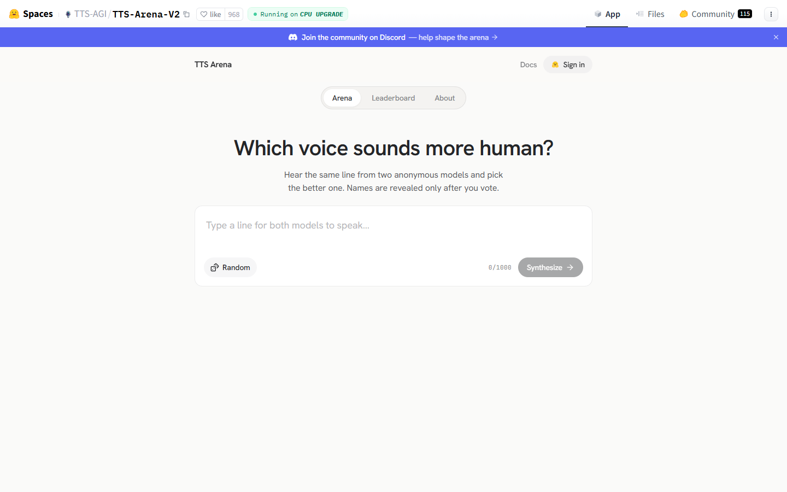
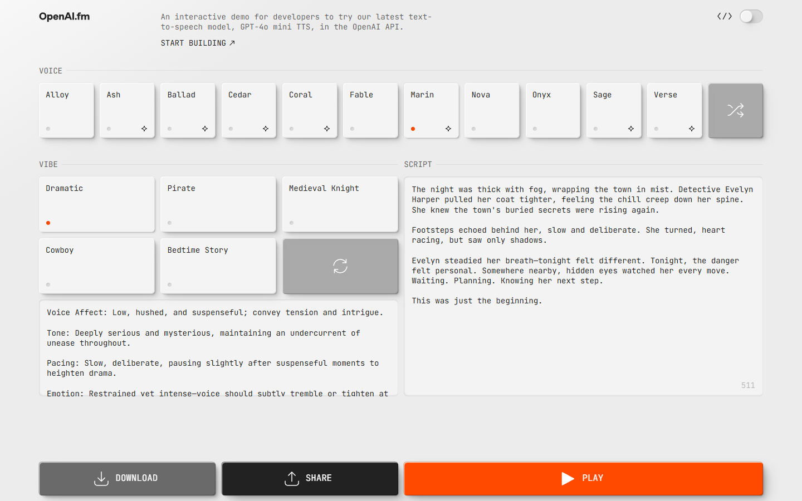
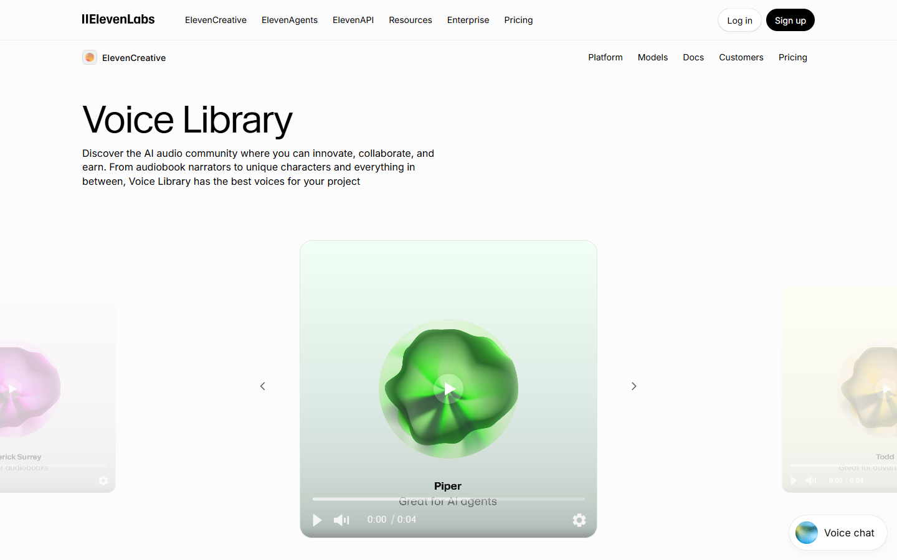
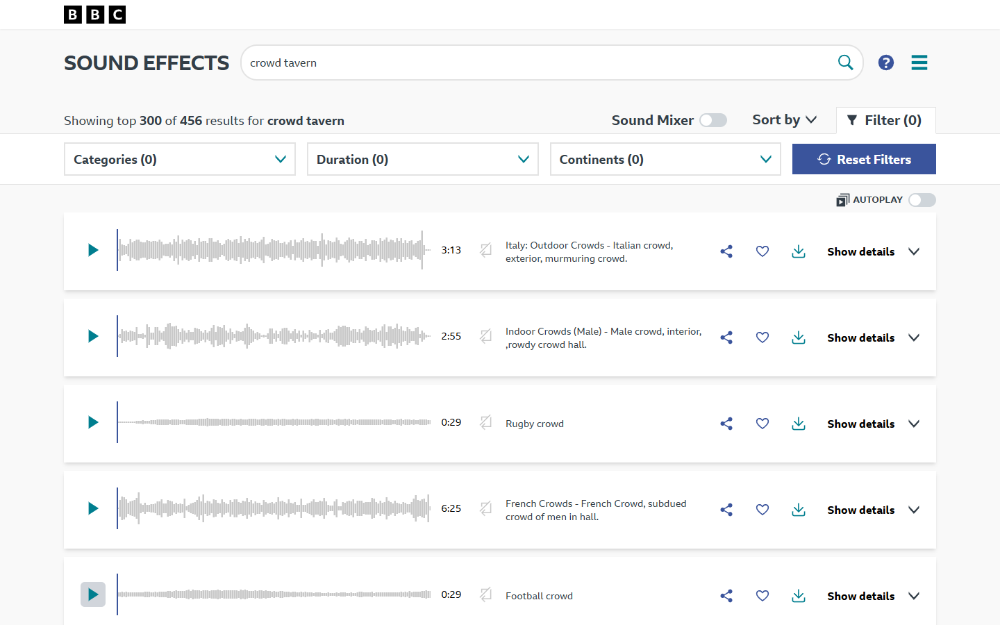
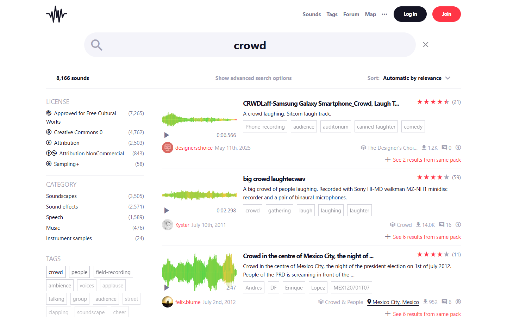
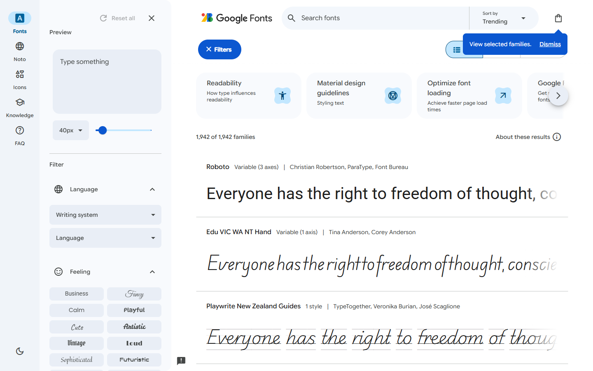
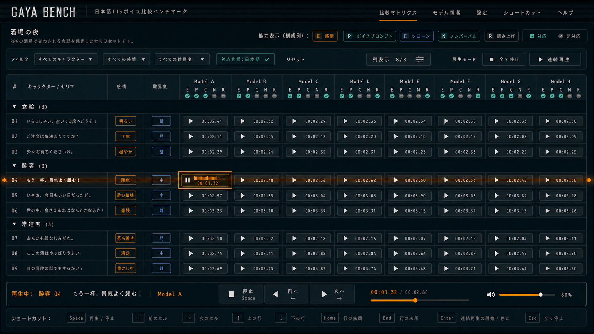
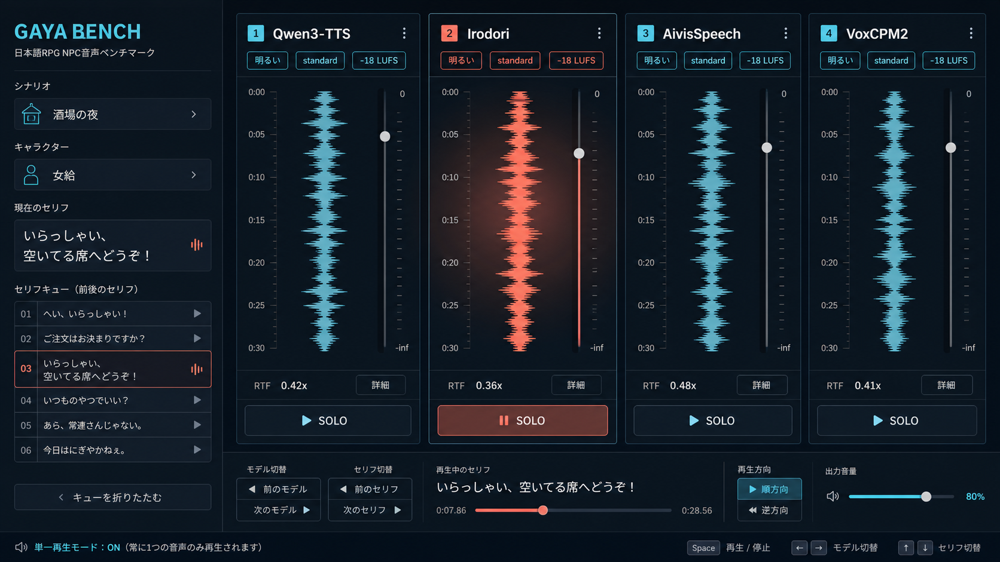
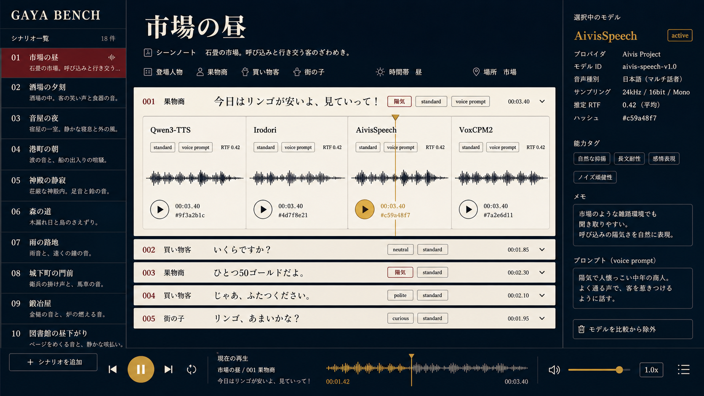
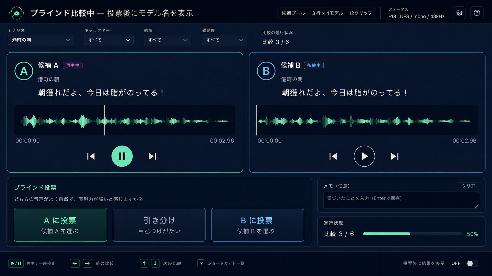

# 試聴・比較 UI UX 調査

調査日: 2026-07-28

対象: 大量の RPG モブ NPC 音声を、同一セリフ・同一条件で素早く聴き比べる Web UI

## 結論

Gaya Bench の主画面は、**同じセリフを全モデルで固定表示するマトリクス**を維持しつつ、次の 4 点を強くするのがよい。

1. 再生中の行とモデル列を同時に示し、「いま何を聴いているか」を迷わせない
2. 画面下部に現在のセリフ・モデル・進捗をまとめた transport を常設する
3. 詳細情報は選択時に開き、平常時のセルは再生に必要な情報だけに絞る
4. キーボードの現在位置、全体内の位置、連続再生方向を常に確認できるようにする

6 例のうち、直接の比較構造は TTS Arena V2、再生状態は BBC Sound Effects、同一内容の大量比較は Google Fonts、選択プリセットは OpenAI.fm が特に参考になる。

## 調査方法

- 未ログインの一般ユーザーとして各公開ページを操作した
- desktop viewport を 1440 × 900 CSS px に統一した
- Playwright で 2026-07-28 に撮影した
- 評価軸:
  - 試聴開始までの摩擦
  - 比較対象と現在位置の明瞭さ
  - 絞り込みと大量走査
  - 単一再生・連続再生
  - キーボードとアクセシビリティ
  - Gaya Bench へ移植できる粒度

## 1. TTS Arena V2

出典: [TTS-AGI / TTS-Arena-V2](https://huggingface.co/spaces/TTS-AGI/TTS-Arena-V2)

### 優れている点

- 「同じ文を 2 つの匿名モデルで聴き、より人間らしい方を選ぶ」という目的が 1 画面で完結している
- モデル名を投票後まで隠すため、ブランド先入観を減らせる
- Arena / Leaderboard / About の 3 導線だけで、初見時の判断負荷が小さい
- Random で入力文を用意でき、空欄から考え始める摩擦を下げている

### 失敗点・Gaya Bench で避ける点

- header に Sign in 導線は見えるが、Synthesize が認証必須であることは実行後の dialog で初めて分かる
- 初期画面では音声プレイヤーと比較結果の最終形が見えず、試聴後の操作を学習しにくい
- 1 回の比較が 2 モデルに限定され、大量のモデルを横断する用途では反復回数が増える
- キーボード操作や全体内の進捗が初期画面から分からない

### Gaya Bench への示唆

- A/B ブラインド画面では「同じセリフ」「匿名」「選択後に開示」の 3 原則を採用する
- 認証を設けない v1 の方針を維持し、投票は localStorage に閉じる
- 何組中の何組目かを表示し、キーボード操作を初期状態から提示する

## 2. OpenAI.fm

出典: [OpenAI.fm](https://www.openai.fm/)、[公開実装](https://github.com/openai/openai-fm)

### 優れている点

- Voice と Vibe をカードで並べ、名前を読まなくても選択肢の数と現在値を把握できる
- Dramatic / Pirate / Medieval Knight など、抽象パラメータではなく話者が理解できる言葉を使う
- Script と音声指示を並置し、何が音声へ影響するかを明確にしている
- Play / Share / Download を画面下部に固定し、長い入力を編集しても主要操作を失わない

### 失敗点・Gaya Bench で避ける点

- 選択状態が小さな色点に依存し、カード数が増えると現在値を見失いやすい
- 1 音声を作る playground としては優れるが、同一文の複数出力を比較できない
- 詳細な Vibe 指示と Script が同じ強さで並び、単に音声を聴きたい利用者には情報量が多い
- 画面下部の強い Play は分かりやすい一方、現在の voice 名との結び付きが離れている

### Gaya Bench への示唆

- emotion / capability は、内部キーではなく「明るい」「囁き」「声質指定対応」など人が判断できる短語にする
- transport には必ずモデル名とセリフを併記し、離れた選択状態を結び直す
- 設定詳細はモデル詳細ページまたは展開パネルへ送り、マトリクスでは音声比較を主役にする

## 3. ElevenLabs Voice Library

出典: [ElevenLabs Voice Library](https://elevenlabs.io/voice-library)

### 優れている点

- 音声サンプルを大きなカードと中央の Play で提示し、試聴できる場所が明快
- 抽象的な音声を色・形・名前で記憶できるようにし、連続試聴時の識別を助ける
- カード自体に進捗、時間、音量を持たせ、再生状態が対象から離れない

### 失敗点・Gaya Bench で避ける点

- 大型カルーセルは 1 声ずつ味わう用途には向くが、同一文を高密度で比較しにくい
- 公開ページから完全なライブラリへ進むにはサインアップが必要で、探索が途中で切れる
- カードの抽象ビジュアルが大きく、セリフ・生成条件・モデル差の表示領域を圧迫する
- 同じ文章を読んでいる保証が視覚的に弱く、純粋なモデル比較には使いにくい

### Gaya Bench への示唆

- モデルごとに安定した色または短い記号を割り当て、聴覚対象の記憶を補助する
- 主マトリクスでは装飾を抑え、カード表現はモバイル表示やモデル詳細に限定する
- 再生進捗はセル内にも出し、共通 transport だけに依存しない

## 4. BBC Sound Effects

出典: [BBC Sound Effects](https://sound-effects.bbcrewind.co.uk/search?q=crowd%20tavern)

### 優れている点

- 検索結果の各行に Play、波形、時間、説明が同じ順序で並び、縦方向に走査しやすい
- 検索、カテゴリ、時間、地域、sort が一覧の直前にあり、結果との因果関係を理解しやすい
- Autoplay と Sound Mixer を明示的なモードとして分離している
- 波形が長さと音の密度を事前に伝え、再生前の選択を助ける

### 失敗点・Gaya Bench で避ける点

- share / favourite / download / details が各行で同じ強さを持ち、Play 以外の操作が視線を奪う
- フィルタが横に広く、項目追加時に折り返しや画面占有が増えやすい
- Play ボタンの現在再生状態とページ全体の「一つだけ再生」の規則が見えにくい
- キーボード導線と行間移動の手掛かりがない

### Gaya Bench への示唆

- 波形は常時表示せず、再生中セルまたは展開詳細だけに使うと密度を保てる
- 主要操作は Play に集中し、共有・詳細・ライセンスは二次導線へ送る
- 連続再生は独立モードとして明示し、方向と停止方法を常に表示する

## 5. Freesound

出典: [Freesound 検索結果](https://freesound.org/search/?q=crowd)

### 優れている点

- ライセンス、カテゴリ、タグに加え、スクロール下部の形式・チャンネル・サンプルレートまで多数の facet を同じ sidebar で確認できる
- 各結果に波形、時間、説明、タグ、評価、ライセンスを揃え、専門家が再生前に候補を絞れる
- 同じ pack の関連項目へ移動でき、似た音を連続探索しやすい
- 検索件数と sort を明示し、結果集合の規模を理解できる

### 失敗点・Gaya Bench で避ける点

- 左 facet、波形、タグ、評価、pack 情報が同時に主張し、初見では Play の位置が埋もれる
- 色の意味が多く、再生中・評価・ライセンス・作者のどれが重要か判断しにくい
- 1 行の高さが大きく、数十件を素早く比較するにはスクロール量が増える
- 専門メタデータが常時露出し、単に聴き比べたい利用者には過剰

### Gaya Bench への示唆

- facet は filter drawer に集約し、適用中の条件だけを toolbar の chip で見せる
- model license や gen_params は詳細ページへ送り、主画面はセリフ・キャラ・emotion・difficulty に限定する
- 色は active / focus / status の少数の意味に固定する

## 6. Google Fonts

出典: [Google Fonts](https://fonts.google.com/)

### 優れている点

- すべての候補に同じ preview text を適用でき、内容差を排除して書体だけを比較できる
- Row / Grid / Sample を切り替え、探索と詳細確認で情報密度を変えられる
- Language / Feeling / Appearance など、利用者の言葉で facet を提供する
- 選択した候補を collection として保持し、全件探索から shortlist 比較へ段階的に移れる

### 失敗点・Gaya Bench で避ける点

- filter drawer が常時開くと比較領域が狭くなり、長文 preview が途中で切れる
- 大きな preview は差が分かりやすい一方、一覧性を大きく落とす
- feeling と appearance の候補数が多く、目的が決まっていない利用者には選択肢が過剰
- collection の存在が右上の小さな icon に寄り、次の行動が分かりにくい

### Gaya Bench への示唆

- **同じセリフを全モデルへ適用する**構造を最優先し、テキスト差をモデル差と誤認させない
- desktop は matrix、mobile は line card とし、同じデータを密度違いで見せる
- shortlist 相当としてモデル列の表示 ON/OFF を保持し、比較対象を絞れるようにする

## 横断パターン

| パターン | 有効な理由 | Gaya Bench での適用 |
| --- | --- | --- |
| 同一内容の固定 | 比較対象以外の差を減らす | 行をセリフ、列をモデルに固定 |
| 対象に近い Play | 何を再生したか迷わない | 各セルを即時再生 chip にする |
| 共通 transport | 画面移動後も状態を失わない | line / model / progress / volume を常設 |
| active の二重表示 | 密集画面でも位置を復元できる | cell の強調 + 行列 crosshair |
| 詳細の段階開示 | 大量走査と専門情報を両立する | 展開 panel / model detail へ分離 |
| 人の言葉による facet | 内部 schema を知らずに絞れる | emotion / character / difficulty を短語化 |
| モードの明示 | 自動再生の驚きを防ぐ | 行方向 / 列方向 / OFF を常時表示 |

## デザイン参考画像

4 方向とも Codex の built-in image generation で作成した UI mock であり、既存サービスの画面を合成したものではない。

### 01 Tactical Console

- RPG command console と音声 QA table を統合
- active cell から行全体へ伸びる amber scan line が signature
- 8 model を 1 画面で比較し、各列 header に capability badge、toolbar に列表示 control を置く
- sticky model header、行グループ、bottom transport、shortcut strip を 1 画面に収める

### 02 Stage Mixer

- 同一セリフを 4 本の model channel として扱う
- SOLO 表現と active channel の光で「一つだけ再生」を強調
- 魅力は強いが、モデル数が増えた場合の横幅と縦波形が課題

### 03 Archive Ledger

- scene と長い日本語セリフの可読性を最優先
- dialogue record を展開すると 4 モデルの waveform contact sheet が現れる
- 主 matrix より scenario view / model detail への転用に向く
- 画像の light palette は方向差を見るための探索案であり、採用時は `ux-spec.md` のダーク基調へ置き換える

### 04 Spectral Map

- 候補 A / B だけを表示し、投票前は model 名を隠す blind comparison
- waveform、投票 control、進行状況を右 inspector に集約
- `3 行 × 4 モデル = 12 クリップ` の母数を示しつつ、1 回の比較対象は 2 候補に限定
- 個性は最も強いが、contour を実装時に減らさないと視覚ノイズになる

## 方向性比較

5 点満点。`実装性` は通常の React / CSS で再現しやすいほど高い。

| 方向 | 主題固有性 | 識別性 | 実装性 | signature | 節度 | 推奨用途 |
| --- | ---: | ---: | ---: | ---: | ---: | --- |
| Tactical Console | 5 | 4 | 5 | 5 | 4 | **主 matrix** |
| Stage Mixer | 4 | 5 | 3 | 4 | 4 | current player / desktop alternative |
| Archive Ledger | 5 | 4 | 4 | 4 | 4 | scenario view |
| Spectral Map | 4 | 5 | 4 | 5 | 3 | blind A/B mode |

### 推奨: Tactical Console

主 matrix の出発点には Tactical Console を推奨する。8 model の列密度、列 header の capability badge、列表示 control、キーボード操作、現在再生位置を同時に示し、既存 `ux-spec.md` の要求と最も直接対応するためである。Stage Mixer の active channel、Archive Ledger の本文可読性、Spectral Map の匿名投票導線は各ビューへ部分的に取り込める。

実装へ渡す最小 token:

| role | value |
| --- | --- |
| canvas | `#0B0D10` |
| surface | `#15191E` |
| line | `#2A3038` |
| text | `#E7E9EC` |
| active | `#F5A623` |
| success | `#43B3A3` |

- type: UI / 本文は日本語 grotesk、時間・RTF・shortcut は tabular mono
- layout: sticky model header、grouped rows、bottom transport、collapsed filter drawer
- motion: 150–200 ms の focus / progress 遷移のみ。常時点滅や装飾 motion は使わない
- signature: active cell と同じ行だけに 1 本の amber scan line を通す

## `ux-spec.md` への改善提案

**提案あり。採否は Director 判断とする。**

1. 比較マトリクスへ `roving tabindex` を明記し、focus cell は常に 1 つ、矢印キーで移動後に再生する
2. active cell だけでなく、active row と model column の交点を視覚的に追える crosshair を追加する
3. bottom transport に `scenario / character / line / model / n of total / progress` を常設する
4. 連続再生は `OFF / 行方向 / 列方向` の 3 状態を明示し、Enter で開始・Esc で全停止できるようにする
5. filter drawer は閉じられるようにし、適用中 filter のみ toolbar chip と URL query に残す
6. model license、gen_params、詳細 capability は matrix から段階開示し、主セルへ載せ過ぎない
7. prefers-reduced-motion 時は scan line の移動を止め、静的な行・列 highlight にする

既存仕様の「同時再生は常に 1 クリップのみ」「URL 状態」「mobile はセリフ単位カード」「-18 LUFS 明記」は調査結果とも一致しており、変更不要である。
